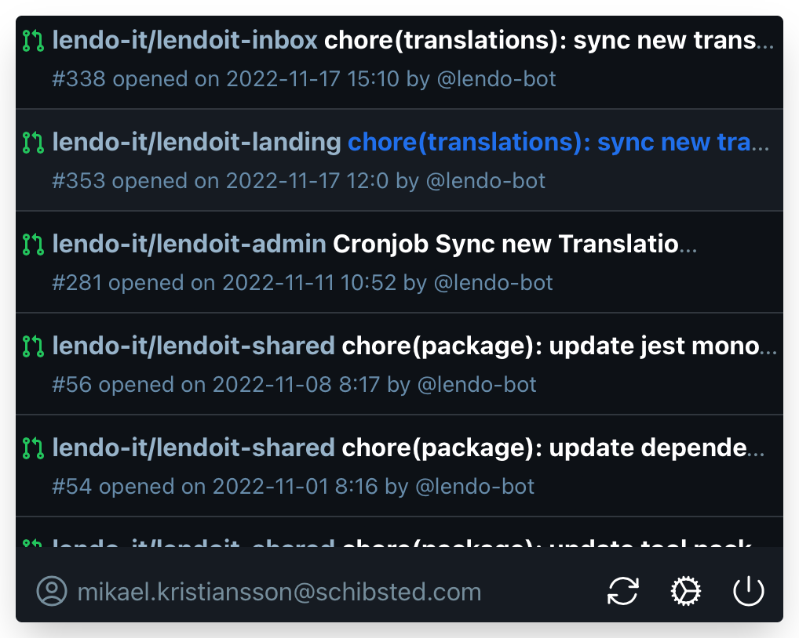

<h1 align="center">GitBar</h1>
<p align="center">
</p>

An system tray app for showing your pull requested reviews.



## Development instructions

### Requirements

[Tauri getting started](https://tauri.app/v1/guides/getting-started/prerequisites)

### Instructions

```sh
# 1 - install dependencies
yarn

# 2 - Run the App in development mode
yarn tauri:dev
```

> note that the first run will take time as tauri download and compile dependencies.

### Production

```sh
yarn tauri:build
```

## Icons
https://primer.style/foundations/icons/
